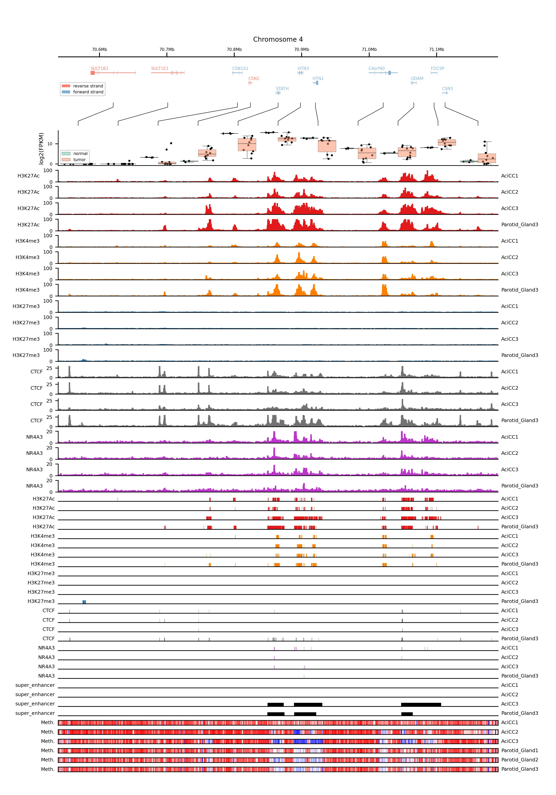

Example
=======

The following example was created using published genomics and epigenomics data from `<https://zenodo.org/record/4557352>`_
The data originates from the publication `<https://www.nature.com/articles/s41467-018-08069-x>`_

The above figure was created using the following code:

.. code-block:: python

    import pyBigWig
    import os
    import hmap
    import pybedtools
    import glob
    import sys
    import matplotlib.pyplot as plt
    import pandas as pnd
    import gelviz
    import warnings
    warnings.filterwarnings("ignore")

    data_folder = "" # path to folder where data from https://zenodo.org/record/4557352 (DOI: 10.5281/zenodo.4557352) is stored
    fpkm_matrix_filename = data_folder+os.sep+"/fpkm_matrix_human.csv"
    samples_dict = {"normal": ["Parotid Gland3", "Parotid Gland4", "Parotid_Gland2"],
                    "tumor": ["AciCC1", "AciCC3", "AciCC8", "AciCC4", "AciCC10", "AciCC9", "AciCC6", "AciCC5", "AciCC2", "AciCC7"]}

    # File´s used for gene plotting
    gelviz_repo_path = "" # Path to clone of https://github.com/HiDiHlabs/gelviz
    genes_bed_filename = gelviz_repo_path+os.sep+"data/gencode.v19.annotation.genes_genes.bed"
    exons_bed_filename = gelviz_repo_path+os.sep+"data/gencode.v19.annotation.genes_exons.bed"
    introns_bed_filename = gelviz_repo_path+os.sep+"data/gencode.v19.annotation.genes_introns.bed"
    gene_map_filename = gelviz_repo_path+os.sep+"data/gencode_v19_ENSGID_GENENAME.tsv"

    samples = ["AciCC1", "AciCC2", "AciCC3", "Parotid_Gland1", "Parotid_Gland2", "Parotid_Gland3", "Parotid_Gland4"]
    chip_types = ["H3K27Ac", "H3K4me3", "H3K27me3", "CTCF", "NR4A3", "super_enhancer"]

    chip_color_dict = {"H3K27Ac": "#e31a1c",
                       "H3K4me3": "#ff7f00",
                       "H3K27me3": "#1f76b4",
                       "CTCF": "#737373",
                       "NR4A3": "#bc36cc",
                       "super_enhancer": "k"}

    ylim_dict = {"H3K27Ac": [0, 100],
                       "H3K4me3": [0, 100],
                       "H3K27me3": [0, 100],
                       "CTCF": [0, 30],
                       "NR4A3": [0, 20]}
    
    # Create a gene_id_map
    gene_map_file = open(gene_map_filename, "r")
    gene_id_map = {}
    for line in gene_map_file:
        split_line = line.rstrip().split("\t")
        
        ensembl_gene_id = split_line[0].split(".")[0]
        hugo_gene_symbol = split_line[1]
        
        gene_id_map[ensembl_gene_id] = hugo_gene_symbol
    gene_map_file.close()
    
    fpkm_matrix_df = pnd.read_csv(fpkm_matrix_filename, sep="\t", index_col = 14)
    
    
    # # Create a browser like plot containing
    # 
    # 1. Genomic coordinates
    # 2. Genes
    # 3. ChIP seq signal tracks
    # 4. ChIP seq peak tracks
    # 5. Methylation profiles
    
    n_signal_tracks = len(glob.glob(data_folder+os.sep+"*_chip_signal_*"))
    n_peak_tracks = len(glob.glob(data_folder+os.sep+"*_peaks_*"))
    n_methylation_tracks = len(glob.glob(data_folder+os.sep+"*_methylationCalls_*"))
    
    region = ["4", 70538611, 71191210]
    region_bed = pybedtools.BedTool("\t".join([str(e) for e in region]), from_string = True)
    
    genes_bed = pybedtools.BedTool(genes_bed_filename)
    introns_bed = pybedtools.BedTool(introns_bed_filename)
    exons_bed = pybedtools.BedTool(exons_bed_filename)
    
    get_ipython().run_line_magic('autoreload', '2')
    
    plot_filename = "pics/salivary_gland_locus_acicc.jpeg"
    
    # Create a figure grid
    fig, gs = hmap.layout.layout.layoutGrid(4+n_signal_tracks+n_peak_tracks+n_methylation_tracks,
                                            1,
                                            [189.],
                                            [5., 15., 10., 15.,]+n_signal_tracks*[5.]+n_peak_tracks*[2.]+n_methylation_tracks*[2.],
                                            2.,
                                            1.,
                                            10.,
                                            20.,
                                            25.,
                                            25.)
    
    # Plot genomic coordinates
    ax = plt.subplot(gs[0,0])
    plt.title("Chromosome "+str(region[0]), fontsize=8)
    gelviz.basic.plotCoordinates(region[0], 
                                 region[1], 
                                 region[2],
                                 ax = ax,
                                 upper=True)
    
    # Plot genes
    ax = plt.subplot(gs[1, 0])
    gelviz.basic.plotGenes(genes_bed.intersect(region_bed, wa=True),
                           exons_bed.intersect(region_bed, wa=True),
                           introns_bed.intersect(region_bed, wa=True),
                           region_bed,
                           gene_map = gene_id_map,
                           ax = ax,
                           plot_legend = True,
                           legend_loc = "lower left")
    ax.axis("off")
    
    # Plot Gene Distance Equalizer
    ax = plt.subplot(gs[2, 0])
    gene_mid_points = gelviz.basic.distanceEqualizer(genes_bed.intersect(region_bed, wa=True),
                                   region[1],
                                   region[2],
                                   ax = ax)
    
    # Plot Gene Expression
    ax = plt.subplot(gs[3, 0])
    gelviz.basic.plotGeneExpressionEqualDist(genes_bed.intersect(region_bed, wa=True),
                                             gene_mid_points,
                                             region,
                                             fpkm_matrix_df,
                                             groups=[samples_dict["normal"], samples_dict["tumor"]],
                                             ids=["normal", "tumor"],
                                             gene_names_map = gene_id_map,
                                             ax = ax,
                                             plot_legend = True,
                                             plot_gene_names = False,
                                             plot_points = True)
    ax.spines["top"].set_visible(False)
    ax.spines["right"].set_visible(False)
    plt.xticks([], [])
    plt.ylabel("log2(FPKM)", fontsize=7)
    
    # Plot ChIP-Signals
    chip_plot_idx = 0
    for chip_type in chip_types:
        for sample in samples:
            signal_filename = glob.glob(data_folder+os.sep+sample+"_"+chip_type+"_chip_signal_*")
            if(not(len(signal_filename) == 1)):
                continue
                
            signal_filename = signal_filename[0]
            bw = pyBigWig.open(signal_filename)
            signal_list = [ [region[0], i[0], i[1], i[2]] for i in bw.intervals(region[0], region[1], region[2]) ]
            
            color =chip_color_dict[chip_type]
            
            ax = plt.subplot(gs[4+chip_plot_idx])
            plt.yticks(fontsize=6)
            ax2 = ax.twinx()
            plt.yticks([], [])
            gelviz.basic.plotChIPSignals(signal_list,
                                         region[0],
                                         region[1],
                                         region[2],
                                         ax = ax,
                                         offset = 100,
                                         merge = 10,
                                         color = color)
            
            ax.spines["top"].set_visible(False)
            ax.spines["right"].set_visible(False)
            ax.set_xticks([], [])
            ax.set_ylim(ylim_dict[chip_type])
            ax2.spines["top"].set_visible(False)
            ax2.spines["right"].set_visible(False)
            ax2.set_xticks([], [])
            ax2.set_ylim(ylim_dict[chip_type])
            ax.set_ylabel(chip_type, 
                       fontsize=6, 
                       rotation = 0,
                       horizontalalignment = "right",
                       verticalalignment = "center")
            
            ax2.yaxis.set_label_position("right")
            ax2.set_ylabel(sample,
                      fontsize=6, 
                       rotation = 0,
                       horizontalalignment = "left",
                       verticalalignment = "center")
            
            plt.yticks(fontsize=6)
            
            chip_plot_idx += 1
    
    # Plot ChIP-peaks
    chip_peak_idx = 0
    for chip_type in chip_types:
        for sample in samples:
            peak_filename = glob.glob(data_folder+os.sep+sample+"_"+chip_type+"_peaks_*")
            if(not(len(peak_filename) == 1)):
                continue
            peak_filename = peak_filename[0]
            
            peak_bed = pybedtools.BedTool(peak_filename)
            
            region_chr_bed = pybedtools.BedTool("\t".join(["chr"+region[0], 
                                                           str(region[1]), 
                                                           str(region[2])]), 
                                                from_string=True)
            
            ax = plt.subplot(gs[4+chip_plot_idx+chip_peak_idx])
            plt.yticks([], [])
            ax2 = ax.twinx()
            plt.yticks([], [])
            gelviz.basic.plotRegions(peak_bed.intersect(region_chr_bed, wa=True),
                                     region[1],
                                     region[2],
                                     color = chip_color_dict[chip_type],
                                     edgecolor=False,
                                     ax = ax)
            ax.set_ylabel(chip_type, 
                       fontsize=6, 
                       rotation = 0,
                       horizontalalignment = "right",
                       verticalalignment = "center")
            
            ax2.yaxis.set_label_position("right")
            ax2.set_ylabel(sample,
                      fontsize=6, 
                       rotation = 0,
                       horizontalalignment = "left",
                       verticalalignment = "center")
            
            #ax. axis("off")
            ax.spines["top"].set_visible(False)
            ax.spines["left"].set_visible(False)
            ax.spines["right"].set_visible(False)
            ax2.spines["top"].set_visible(False)
            ax2.spines["left"].set_visible(False)
            ax2.spines["right"].set_visible(False)
            chip_peak_idx += 1
    
    # Plot Methylation Profiles
    methylation_idx = 0
    for sample in samples:
        meth_filename = glob.glob(data_folder+os.sep+sample+"_"+"methylationCalls"+"*")
        if(not(len(meth_filename) == 1)):
            continue
        meth_filename = meth_filename[0]
        meth_bed = pybedtools.BedTool(meth_filename)
        
        meth_list = [ [str(e[0]), 
                       int(e[1]),
                       int(e[2]),
                       int(e[4]),
                       int(e[5])] for e in meth_bed.intersect(region_bed, wa=True) ]
        
        ax = plt.subplot(gs[4+chip_plot_idx+chip_peak_idx+methylation_idx])
        plt.yticks([], [])
        ax2 = ax.twinx()
        plt.yticks([], [])
        gelviz.basic.plotMethylationProfileHeat(meth_list,
                                                region[0],
                                                region[1],
                                                region[2],
                                                ax = ax)
        ax.set_ylabel("Meth.", 
                   fontsize=6, 
                   rotation = 0,
                   horizontalalignment = "right",
                   verticalalignment = "center")
        
        ax2.yaxis.set_label_position("right")
        ax2.set_ylabel(sample,
                      fontsize=6, 
                       rotation = 0,
                       horizontalalignment = "left",
                       verticalalignment = "center")
        
        methylation_idx += 1
        
    plt.savefig(plot_filename)
